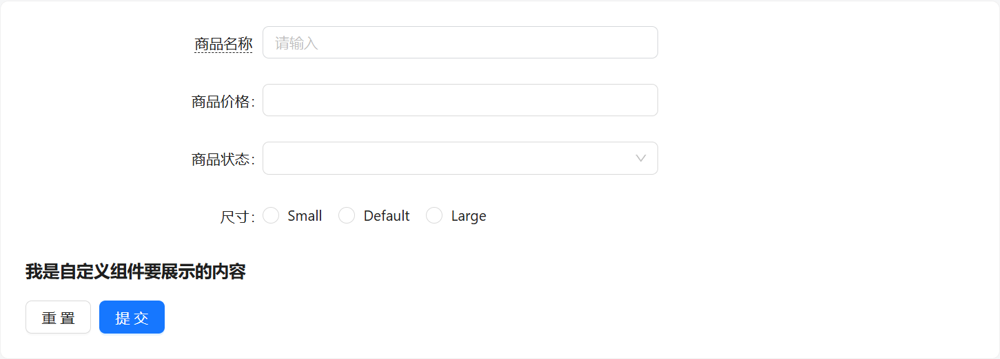
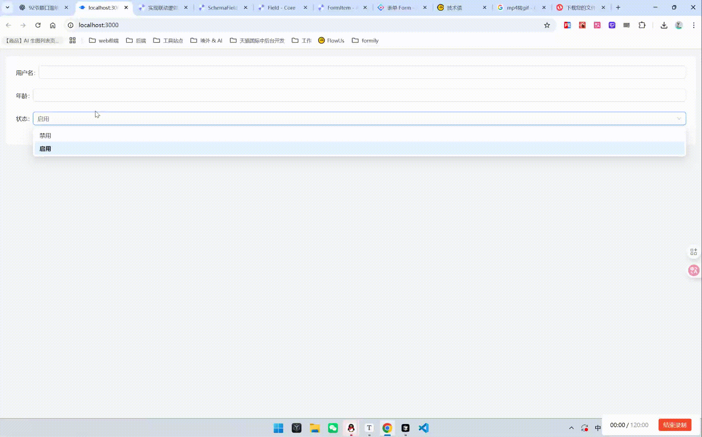

# Formily

> 作者：belong
>
> 学习时间：2025-11-29

npm 依赖包版本：

```json
"dependencies": {
  "@formily/antd-v5": "^1.2.4",
  "@formily/core": "^2.3.7",
  "@formily/react": "^2.3.7",
  "antd": "^5.29.1",
  "react": "^18.2.0",
  "react-dom": "^18.2.0"
},
```

## 一、前言：为什么要学 Formily

### 1.1 背景与痛点

在前端开发中，表单无处不在：用户注册、订单填写、后台管理系统、低代码平台等，几乎每个项目都会涉及表单功能。传统表单开发中，我们经常会遇到以下问题：

1. **重复工作量大**
   - 每次新建表单都要写一堆 `Form.Item` + `Input`/`Select`，尤其是后台管理系统，表单字段非常多。
   - 联动逻辑需要在 `onChange` 中手动写，容易出错。
2. **表单联动复杂**
   - 某些字段的显示/禁用/必填状态依赖其他字段的值。
   - 用原生 `onChange` + 状态管理很容易写成 spaghetti code（杂乱逻辑），维护困难。
3. **低代码/配置化需求**
   - 很多企业内部系统希望从后台返回 JSON 配置就能生成表单，而不是每次写固定 JSX。
   - 传统表单很难做到完全配置化。
4. **状态管理和校验复杂**
   - 每个字段的值、校验状态、禁用状态都需要自己管理
   - 随着表单复杂度增加，状态耦合度高，维护成本大。

### 1.2 Formily 是什么

基于以上痛点，阿里内部沉淀出了**Formily 表单解决方案**，它提供了：

1. **响应式表单状态管理**
   - 通过 `form` 对象管理整个表单的值、校验、状态，字段之间可以轻松联动。
2. **Schema 驱动表单**
   - 使用 JSON / JSX / Markup 定义表单结构
   - 方便动态生成表单、低代码配置表单、快速复用。
3. **声明式联动**
   - 通过 `effects`、`x-reactions`、`onFieldValueChange` 等 API，可以轻松实现字段间的联动，逻辑清晰可维护。
4. **布局与装饰器统一管理**
   - `FormLayout` + `FormItem` 提供统一的 label、校验、提示、响应式布局管理。
5. **与 Ant Design 深度结合**
   - 可以直接复用 antd 的组件（Input、Select、Radio、Checkbox 等），快速上手。
6. **支持动态表单和数组字段**
   - ArrayField、动态增删字段、嵌套表单都非常方便，减少手动状态管理。

### 1.3 笔者观点

笔者个人认为，Formily 本质上更像是为 **低代码/配置化表单场景**设计的产物，以及**面对复杂表单联动时**的一个方案

官方强调的“表单联动、响应式管理”等优势，实际上在普通组件库中也可以通过现有 API 实现，因此不必过度依赖 Formily。

Formily 存在的核心价值在于：**通过 JSON/Schema 配置表单，提供一层对组件库的扩展**，让表单的动态生成、状态管理和联动逻辑更加集中和规范。

换句话说，它更适合需要 **动态表单、低代码平台或复杂后台系统** 的场景，而不是单纯为了替代普通组件库的表单功能。

### 1.4 文档适用范围

目前 Formily 的维护频率已经很低。笔者之所以撰写这篇文档，主要是因为阿里内部仍在使用该库，且官方文档写的一坨 shit，导致新人学习成本较高。希望本篇文档能够帮助小白快速入门，理清基础用法和常见场景。

本篇文档仅适用于 **Formily 的入门级教程**，覆盖基础使用和常见场景。对于更复杂或特殊的需求，还需结合官方文档或源码自行学习。

## 二、快速上手

### 2.1 依赖安装

在开始使用 Formily 之前，需要先安装核心库和 UI 适配库。Formily 采用 **核心 + 渲染层分离** 的设计：

1. **@formily/core**
   - 表单核心库，提供表单状态管理、字段状态树、校验、联动等功能
   - 所有表单逻辑都依赖于它
   - 提供`createForm`核心方法创建表单实例
2. **@formily/react**
   - React 渲染层，负责把 Formily 的状态绑定到 React 组件上
   - 提供 `FormProvider`、`createSchemaField` 等核心组件
3. **@formily/antd**
   - Ant Design UI 适配库，在 antd 组件库之上扩展了一些额外表单组件
   - 内置了 `FormItem`、表单布局、与 Antd 组件的适配器
   - 支持 `Input`、`Select`、`Radio` 等 Antd 组件直接作为 `x-component` 使用

执行如下命令

```bash
npm install --save @formily/core @formily/react @formily/antd
```

### 2.2 入门案例

> Formily 提供三种构建表单的方式，不同场景适用不同写法：
>
> - **Markup Schema**：在 JSX 中以标签方式编写 Schema，既保持结构化，又有组件的直观性，适合多数日常业务场景。
> - **JSON Schema**：完全配置化的 Schema 格式，不依赖 JSX，更适合服务端动态下发、可视化搭建等需要“纯 JSON”的场景。
> - **纯 JSX 写法**：不依赖 Schema，直接使用 Formily 的组件与钩子构建表单，更接近传统 React 写法，适用于简单表单或需要高度灵活控制的场景。

#### 2.2.1 Markup Schema 写法

参考文档：SchemaField：https://react.formilyjs.org/zh-CN/api/components/schema-field

表单：



代码示例：

```tsx
import { Input, Select, FormItem, FormButtonGroup, Submit, Form, Reset, Radio } from '@formily/antd-v5'
import { createForm } from '@formily/core'
import { createSchemaField } from '@formily/react'

const Title = (props) => <h3>{props.text}</h3>

// createSchemaField：生成 SchemaField 组件，需要传入实际渲染的组件
const SchemaField = createSchemaField({
  components: {
    Input,
    Select,
    FormItem,
    Title,
    Radio,
  },
})

// 创建表单实例
const form = createForm()

const Demo: React.FC = () => {
  return (
    <Form
      form={form}
      labelCol={6}
      wrapperCol={10}
      // 处理表单的提交
      onAutoSubmit={(formValues) => {
        console.log('values:', formValues)
      }}
    >
      <SchemaField>
        {/* 输入框 */}
        <SchemaField.String
          name="goodName"
          title="商品名称"
          x-decorator="FormItem"
          x-component="Input"
          x-decorator-props={{
            labelAlign: 'right',
            tooltip: '提示提示',
            tooltipLayout: 'text',
            colon: false, // 不展示冒号，默认为true
          }}
          x-component-props={{
            placeholder: '请输入',
          }}
        />

        {/* 输入框 */}
        <SchemaField.String name="goodPrice" title="商品价格" x-decorator="FormItem" x-component="Input" />

        {/* 下拉框 */}
        <SchemaField.String
          name="goodStatus"
          title="商品状态"
          x-decorator="FormItem"
          x-component="Select"
          enum={[
            { label: '选项1', value: 1 },
            { label: '选项2', value: 2 },
          ]}
        />

        {/* 单选框 */}
        <SchemaField.String
          name="size"
          title="尺寸"
          x-decorator="FormItem"
          x-component="Radio.Group"
          enum={[
            { value: 'small', label: 'Small' },
            { value: 'default', label: 'Default' },
            { value: 'large', label: 'Large' },
          ]}
        />

        {/* 自定义组件 */}
        <SchemaField.Void x-component="Title" x-component-props={{ text: '我是自定义组件要展示的内容' }} />
      </SchemaField>

      <FormButtonGroup>
        <Reset>重置</Reset>
        <Submit>提交</Submit>
      </FormButtonGroup>
    </Form>
  )
}

export default Demo
```

看到这里一定有很多人会对`<SchemaField.xxxx/>`组件和`x-component`这种写法感到困惑，笔者一开始也是，官网文档也是找了半天：

- API 参考文档链接： https://react.formilyjs.org/zh-CN/api/components/schema-field

#### 2.2.2 JSON Schema 写法

表单：


代码示例：

```tsx
import { Input, Select, FormItem, FormButtonGroup, Submit, Form, Reset, FormLayout } from '@formily/antd-v5'
import { createForm } from '@formily/core'
import { createSchemaField } from '@formily/react'

// 注册 SchemaField 组件
const SchemaField = createSchemaField({
  components: {
    Input,
    FormItem,
    Select,
  },
})

// 定义 Schema（JSON 配置表单）
const schema = {
  type: 'object',
  properties: {
    goodName: {
      type: 'string',
      title: '商品名称',
      'x-decorator': 'FormItem', // 装饰器
      'x-component': 'Input', // 组件
      'x-decorator-props': {
        // 装饰器属性
        labelAlign: 'right',
        tooltip: '提示提示',
        tooltipLayout: 'text',
        colon: false,
      },
      'x-component-props': {
        // 组件属性
        placeholder: '请输入',
      },
    },
    goodPrice: {
      type: 'string',
      title: '商品价格',
      'x-decorator': 'FormItem',
      'x-component': 'Input',
    },
    goodStatus: {
      type: 'string',
      title: '商品状态',
      'x-decorator': 'FormItem',
      'x-component': 'Select',
      'x-component-props': {
        options: [
          { label: '选项1', value: 1 },
          { label: '选项2', value: 2 },
        ],
      },
    },
  },
}

// 创建 Form 实例
const form = createForm()

const Demo: React.FC = () => {
  return (
    <Form
      form={form}
      // 处理表单的提交
      onAutoSubmit={(formValues) => {
        console.log('values:', formValues)
      }}
    >
      <FormLayout labelCol={6} wrapperCol={10}>
        <SchemaField schema={schema} />
      </FormLayout>

      <FormButtonGroup>
        <Reset>重置</Reset>
        <Submit>提交</Submit>
      </FormButtonGroup>
    </Form>
  )
}

export default Demo
```

​

#### 2.2.3 纯 JSX 写法

表单：


代码示例：

```tsx
import { Input, Select, FormItem, FormButtonGroup, Submit, Form, Reset, FormLayout } from '@formily/antd-v5'
import { createForm } from '@formily/core'
import { Field } from '@formily/react'

// 创建 Form 实例
const form = createForm()

const Demo: React.FC = () => {
  return (
    <Form
      form={form}
      labelCol={6}
      wrapperCol={10}
      // 处理表单的提交
      onAutoSubmit={(formValues) => {
        console.log('values:', formValues)
      }}
    >
      <Field
        name="username"
        title="用户名"
        decorator={[FormItem]}
        component={[
          Input,
          {
            placeholder: '请输入用户名',
          },
        ]}
      />

      <Field
        name="status"
        title="状态"
        required
        decorator={[FormItem]}
        component={[
          Select,
          {
            placeholder: '请选择哈',
            options: [
              { label: '禁用', value: 0 },
              { label: '启用', value: 1 },
            ],
          },
        ]}
      />

      <FormButtonGroup>
        <Reset>重置</Reset>
        <Submit>提交</Submit>
      </FormButtonGroup>
    </Form>
  )
}

export default Demo
```

## 三、Formily 操作表单字段

> Formily 中操作表单字段的 API 有非常多，官方文档看的笔者眼花缭乱，笔者这里就列举最常用的几个 API~
>
> 参考文档：
>
> - Form：https://core.formilyjs.org/zh-CN/api/models/form
> - Field：https://core.formilyjs.org/zh-CN/api/models/field

代码基本架构：

```tsx
import React from 'react'
import { Form, FormItem, Input, Select } from '@formily/antd-v5'
import { createForm } from '@formily/core'
import { createSchemaField } from '@formily/react'
import { Button } from 'antd'

const SchemaField = createSchemaField({
  components: { FormItem, Input },
})

const form = createForm()

const FormilyDemo: React.FC = () => {
  return (
    <>
      <Form form={form}>
        <SchemaField>
          <SchemaField.String name="username" title="用户名" x-decorator="FormItem" x-component="Input" required />
        </SchemaField>
      </Form>

      <Button onClick={() => handleGetFormInfo()}>查询表单字段信息</Button>
      <Button onClick={() => handleSetFormInfo()}>设置表单字段信息</Button>
    </>
  )
}
export default FormilyDemo
```

### 3.1 获取表单字段数据

通过 **Form 实例** 获取表单字段数据

```tsx
// 方式一：通过 form.getFieldState() 获取所有字段的值（最常用）
const { value, required, visible, disabled } = form.getFieldState('username')

// 方式二：通过 form.getValuesIn(path) 获取某个路径的值
const username = form.getValuesIn('username')
```

通过 **Field 实例** 获取当前字段信息

```tsx
// 获取字段节点实例
const userNameField = form.query('username').take() as Field

// 方式一：获取完整状态
const { value, required, visible, disabled } = userNameField.getState()

// 方式二：也可以通过 Field.xxx 形式拿取字段数据
const value = userNameField.value
```

能获取哪些信息？

```tsx
const field = form.query('username').take()

console.log(field.value) // 字段的当前值
console.log(field.required) // 是否必填
console.log(field.disabled) // 是否禁用
console.log(field.visible) // 是否可见
console.log(field.editable) // 是否可编辑
console.log(field.description) // 字段描述
console.log(field.title) // 字段标题
console.log(field.component) // 字段使用的组件类型与 props
console.log(field.decorator) // 装饰器信息
console.log(field.query) // 子字段/路径查询器
```

### 3.2 修改表单字段数据

通过 **Form 实例** 修改表单字段数据

```tsx
form.setFieldState('username', (field) => {
  field.value = '张三' // 更改值
  field.required = false // 更改是否必填
  field.disabled = true // 更改是否禁用
  field.visible = false // 更改是否隐藏
  field.componentProps = { placeholder: '请输入用户名' } // 更改组件属性
})

form.setValuesIn('username', '李四') // 更改表单值
```

通过 **Field 实例** 修改当前字段信息

```tsx
// 获取表单字段节点
const userNameField = form.query('username').take() as Field

// 方式一：通过setXXX() 方法来更改
userNameField.setState({
  value: '张三',
  required: false,
  disabled: true,
  visible: false,
})

// 修改字段组件属性
userNameField.setComponentProps({
  placeholder: '请输入用户名',
})

// 方式二：通过 Field.xxx = xxx 进行更改
userNameField.value = 111
userNameField.componentProps = {
  placeholder: '请输入用户名111',
}
```

## 四、表单联动

联动场景例子：显示/隐藏、禁用/启用、自动填充、联动选项等

实现效果：



### 4.1 Effect 联动

代码示例：

```tsx
import React from 'react'
import { Form, FormItem, Input, Select } from '@formily/antd-v5'
import { createForm, onFieldValueChange } from '@formily/core'
import { createSchemaField } from '@formily/react'

const SchemaField = createSchemaField({
  components: {
    FormItem,
    Input,
    Select,
  },
})

const form = createForm({
  // effect 中的 form 和外层的 form 是一个东西，可以同享 API
  effects(form) {
    // 监听 status 字段的变化
    onFieldValueChange('status', (statusField) => {
      // -------- 一对一 联动 ----------
      form.setFieldState('username', (usernameField) => {
        // goodName字段禁用状态取决于 goodStatus 字段值
        usernameField.disabled = statusField.getState().value === 0
      })
    })

    // 监听 status 字段的变化
    onFieldValueChange('status', (statusField) => {
      // -------- 一对多 联动 ----------
      form.setFieldState('*(username, age)', (commonField) => {
        commonField.disabled = statusField.getState().value === 0
      })
    })
  },
})

const FormilyDependentDemo: React.FC = () => {
  return (
    <Form form={form}>
      <SchemaField>
        <SchemaField.String name="username" title="用户名" x-decorator="FormItem" x-component="Input" />
        <SchemaField.String name="age" title="年龄" x-decorator="FormItem" x-component="Input" />

        <SchemaField.String
          name="status"
          title="状态"
          x-decorator="FormItem"
          x-component="Select"
          enum={[
            { label: '禁用', value: 0 },
            { label: '启用', value: 1 },
          ]}
        />
      </SchemaField>
    </Form>
  )
}

export default FormilyDependentDemo
```

### 4.2 x-reactions 联动

代码示例:

```tsx
import React from 'react'
import { Form, FormItem, Input, Select } from '@formily/antd-v5'
import { createForm } from '@formily/core'
import { createSchemaField } from '@formily/react'

const SchemaField = createSchemaField({
  components: {
    FormItem,
    Input,
    Select,
  },
})

const form = createForm()

const FormilyDependentDemo: React.FC = () => {
  return (
    <Form form={form}>
      <SchemaField>
        <SchemaField.String name="username" title="用户名" x-decorator="FormItem" x-component="Input" />
        <SchemaField.String name="age" title="年龄" x-decorator="FormItem" x-component="Input" />

        <SchemaField.String
          name="status"
          title="状态"
          x-decorator="FormItem"
          x-component="Select"
          enum={[
            { label: '禁用', value: 0 },
            { label: '启用', value: 1 },
          ]}
          x-reactions={{
            // target 表示联动的目标字段
            // target: 'username',  // 一对一
            target: '*(username, age)', // 一对多

            // fulfill 表示当当前字段满足条件时，要执行的动作
            fulfill: {
              // state 用来修改目标字段的状态
              state: {
                // $self.value 代表当前字段的值
                disabled: '{{$self.value === 0}}',
              },
            },
          }}
        />
      </SchemaField>
    </Form>
  )
}

export default FormilyDependentDemo
```

### 4.3 onChange 联动

代码示例：

```tsx
import React from 'react'
import { Form, FormItem, Input, Select } from '@formily/antd-v5'
import { createForm } from '@formily/core'
import { createSchemaField } from '@formily/react'

const SchemaField = createSchemaField({
  components: {
    FormItem,
    Input,
    Select,
  },
})

const form = createForm()

const FormilyDependentDemo: React.FC = () => {
  return (
    <Form form={form}>
      <SchemaField>
        <SchemaField.String name="username" title="用户名" x-decorator="FormItem" x-component="Input" />
        <SchemaField.String name="age" title="年龄" x-decorator="FormItem" x-component="Input" />

        <SchemaField.String
          name="status"
          title="状态"
          x-decorator="FormItem"
          x-component="Select"
          enum={[
            { label: '禁用', value: 0 },
            { label: '启用', value: 1 },
          ]}
          x-component-props={{
            onChange(value) {
              form.setFieldState('*(username, age)', (state) => {
                state.disabled = value === 0
              })
            },
          }}
        />
      </SchemaField>
    </Form>
  )
}

export default FormilyDependentDemo
```

### 4.4 antd 联动

在 AntD 中，并没有像 Formily 那样提供 `Form.setFieldState()` 这样的接口。目前，表单状态管理主要依赖 `setFieldsValue` / `getFieldValue`。如果想实现联动（比如根据某个字段值控制其他字段的禁用状态），通常需要借助 `useWatch` 去监听字段变化。

然而，`useWatch` 在面对复杂联动时显得力不从心：

- 代码往往分散在不同地方，缺乏统一管理；
- 无法实现 Formily 那种被动联动效果，即修改状态时自动同步影响其他字段。

代码示例：

```tsx
import { Form, Input, Select } from 'antd'

const Demo: React.FC = (props) => {
  // 创建 form 实例的对象
  const [form] = Form.useForm()

  // 监听 status 字段的变化,获取最新的 status
  const status = Form.useWatch('status', form)

  // 如果要监听多个字段，则要写多个useWatch，这在后期无疑是灾难级别代码

  return (
    <Form form={form}>
      <Form.Item name="username" label="用户名">
        <Input disabled={status === 0} />
      </Form.Item>
      <Form.Item name="age" label="年龄">
        <Input disabled={status === 0} />
      </Form.Item>

      <Form.Item name="status" label="状态">
        <Select
          options={[
            { label: '禁用', value: 0 },
            { label: '启用', value: 1 },
          ]}
        />
      </Form.Item>
    </Form>
  )
}

export default Demo
```

结论：

- 当遇到复杂表单联动的时，使用 Formily 是一个更为明智的选择~
